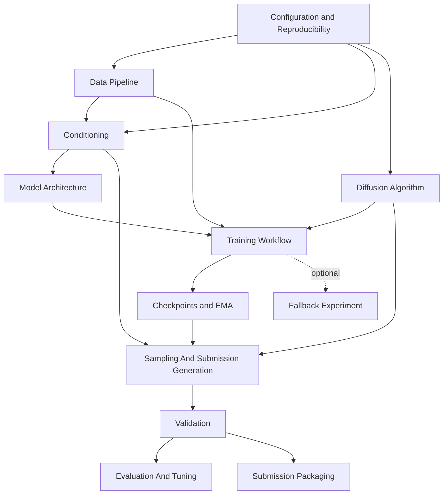

# Detailed Design

## Purpose

Design a reproducible from-scratch conditional image generation system for HW6 Brainrot Image Generation. The system trains a main generator without pretrained generative weights and produces exactly 2,000 RGB PNG images at 64x64 resolution for the rows in `generate.csv`.

The design follows `doc/proposal.md` and the assignment specification in `Brainrot_Image_Gen.pdf`. It keeps unresolved implementation choices explicit because the local repository currently contains design/research files only, with no dataset, source tree, tests, package metadata, or local metric files observed.

## Source Proposal Summary

The proposal recommends a pixel-space class-conditional DDPM trained from scratch with:

- epsilon-prediction MSE training objective;
- 1,000 training diffusion timesteps;
- cosine noise schedule, with linear schedule retained only as a debugging fallback;
- compact conditional UNet for 64x64 RGB images;
- learned animal, object, and pair embeddings;
- condition dropout for classifier-free guidance;
- EMA weights for sampling;
- DDIM sampling with configurable step count for final generation;
- local validation plus optional FID and CLIP-T proxy evaluation.

The assignment requires a conditional image generation model for 10 animals and 10 objects, giving 100 animal-object pairs. The training set contains 4,799 images. The hidden test set contains 3,000 images, with 30 images per pair. The final output must contain 2,000 PNG images, with 20 images per pair, matching `generate.csv` rows and filenames.

## Design Goals

- Train the main generator from scratch using direct PyTorch code.
- Avoid pretrained UNet, Transformer, diffusion, GAN, Stable Diffusion, Diffusers pipeline, or other generative model weights in the submitted generation path.
- Generate one image per `generate.csv` row into `generated_images/`.
- Preserve stable animal, object, and pair mappings between training and generation.
- Support reproducibility through saved config, seed, checkpoint, EMA weights, and mappings.
- Provide structural validation before Codabench upload.
- Provide optional local FID and CLIP-T proxy evaluation when required files and dependencies are available.
- Keep every module independently testable where possible.

## Non-Goals

- Build a web UI, service API, distributed training system, or production inference service.
- Depend on high-level generation pipelines such as Diffusers for training or sampling.
- Use external generated images as the primary solution.
- Make package manager, dataset path, or GPU budget decisions that are not present in the proposal or repository.
- Guarantee a target leaderboard score before empirical training and tuning.

## Architecture Overview

The implementation should be script-driven and organized around explicit file and tensor contracts.

Core runtime flow:

1. Load configuration and set seed.
2. Read `train.csv` and image files from a configured dataset root.
3. Build or load stable condition mappings.
4. Train the conditional diffusion model and update EMA weights.
5. Save checkpoints containing model, EMA, optimizer state, config, seed, and mappings.
6. Load EMA weights and `generate.csv`.
7. Generate exactly one PNG per row.
8. Validate `generated_images/` before metric evaluation or packaging.

## Module Designs

### Configuration and Reproducibility

#### Responsibility

Own all runtime settings and reproducibility metadata. This module does not load images, train models, or generate samples.

#### Inputs and Outputs

Inputs:

- A config file and/or command-line arguments, once the implementation layout is chosen.
- User-supplied paths for dataset root, `train.csv`, `generate.csv`, output directory, checkpoint path, and optional metric files.

Outputs:

- A resolved config object.
- A serialized copy of the config stored in checkpoints and final artifacts.
- Seed settings for Python, NumPy, and PyTorch.

#### Internal Design

- Store settings for paths, seed, image size, batch size, optimizer, diffusion schedule, UNet size, EMA decay, guidance scale, DDIM steps, checkpoint cadence, and validation paths.
- Validate that required paths are present before the workflow starts.
- Keep local machine-specific paths out of saved artifacts when possible; save logical paths and document command examples separately.
- Treat GPU-dependent values as configurable, not fixed design facts.

#### Dependencies

- Standard configuration parsing utilities.
- PyTorch only for seed and deterministic runtime settings.

#### Failure Handling

- Fail fast when required config fields are absent.
- Report missing files with the exact unresolved path.
- Warn when deterministic settings cannot be fully guaranteed by the selected PyTorch/CUDA operations.

#### Independent Test Plan

- Construct a minimal config fixture and assert fields resolve to expected typed values.
- Test missing required paths produce clear errors.
- Test seed setup produces repeatable random values for Python, NumPy, and PyTorch on the same machine.

#### Open Questions

- Which package/config style should be used: plain YAML, TOML, Python dataclass defaults, or another course-preferred format?
- What GPU and training time budget should the default config target?

### Data Pipeline

#### Responsibility

Read assignment metadata and training images, validate image records, apply conservative transforms, and return tensors plus condition labels. This module does not own label vocabularies or model behavior.

#### Inputs and Outputs

Inputs:

- Dataset root.
- `train.csv` with columns `id`, `animal`, `object`.
- Training image files referenced by `id`.

Outputs:

- Image tensors shaped `[3, 64, 64]`, normalized for diffusion training.
- Animal/object strings or ids, depending on the boundary chosen with the Conditioning module.
- Dataset diagnostics such as count, missing files, invalid labels, and invalid image modes/sizes.

#### Internal Design

- Load CSV rows with a structured parser.
- Resolve each `id` to an image path under the configured training image directory.
- Convert images to RGB.
- Resize to 64x64 only if the configured policy permits resizing; otherwise validate that inputs already match 64x64.
- Normalize image values to the diffusion model range, expected to be `[-1, 1]`.
- Apply only conservative augmentation initially, such as horizontal flip and mild color jitter, and keep it configurable.
- Keep augmentations label-preserving; avoid transforms likely to obscure the object or animal identity.

#### Dependencies

- Configuration and Reproducibility.
- Conditioning for label validation and id conversion.
- PIL or torchvision image I/O and transforms.

#### Failure Handling

- Fail on missing required CSV columns.
- Fail or collect diagnostics for missing image files, depending on validation mode.
- Fail on unknown animal/object labels unless the Conditioning module explicitly supports extension.
- Report non-RGB or invalid-size images before training starts.

#### Independent Test Plan

- Use a temporary fixture with a tiny CSV and synthetic RGB PNGs.
- Test CSV parsing, image loading, RGB conversion, size validation, normalization range, and label handoff.
- Test missing file and missing column errors without constructing a model.

#### Open Questions

- Where will the dataset root, image folder, `train.csv`, and `generate.csv` be placed locally?
- Should the data policy resize non-64x64 training images or fail validation?

### Conditioning

#### Responsibility

Own the stable mapping from assignment labels to numeric ids and provide condition ids for training and generation. This module does not read image pixels or write generated PNGs.

#### Inputs and Outputs

Inputs:

- Animal and object strings from `train.csv` or `generate.csv`.
- Optional persisted mapping from a checkpoint.
- Optional condition-dropout mask during training.

Outputs:

- Animal id in a 10-class vocabulary.
- Object id in a 10-class vocabulary.
- Pair id in a 100-class vocabulary.
- Optional null/unconditional ids for classifier-free guidance.
- Persisted mapping data for checkpoints.

#### Internal Design

- Use the assignment vocabularies:
  - animals: `shark`, `crocodile`, `frog`, `cat`, `dog`, `capybara`, `elephant`, `bird`, `fish`, `monkey`;
  - objects: `sneaker`, `airplane`, `coffee cup`, `banana`, `cactus`, `toilet`, `pizza`, `drum`, `car`, `chair`.
- Define pair ids deterministically from `(animal_id, object_id)`.
- Persist both vocabularies and pair mapping in checkpoints.
- During classifier-free guidance training, replace condition ids with null ids according to a configurable dropout probability.
- Keep optional CLIP-derived condition features out of the first required path unless explicitly enabled and documented as auxiliary.

#### Dependencies

- Configuration and Reproducibility.
- PyTorch only if this module also owns embedding layers; otherwise embedding layers can live inside Model Architecture.

#### Failure Handling

- Fail on labels outside the assignment vocabulary.
- Fail generation if `generate.csv` contains a pair that has no mapping and dynamic pair extension is disabled.
- Validate loaded checkpoint mappings against the assignment vocabulary before sampling.

#### Independent Test Plan

- Test all 10 animals, 10 objects, and 100 pairs map deterministically.
- Test pair id creation is stable across process restarts.
- Test unknown label errors.
- Test condition dropout can produce null ids while preserving tensor shapes.

#### Open Questions

- Should optional pretrained CLIP condition embeddings be included later, or should the first implementation remain learned class embeddings only?

### Diffusion Algorithm

#### Responsibility

Own the forward noising equations, training loss support, and DDIM sampling coefficients. This module does not own the neural network architecture or CSV parsing.

#### Inputs and Outputs

Inputs:

- Clean image tensor `x_0`.
- Timestep tensor `t`.
- Gaussian noise tensor `epsilon`.
- Schedule configuration.
- DDIM step count and eta value for sampling.

Outputs:

- Noisy tensor `x_t`.
- Schedule tensors such as alpha, beta, cumulative alpha, and posterior coefficients.
- Training target `epsilon`.
- DDIM timestep sequence and update coefficients.

#### Internal Design

- Implement the DDPM forward process for epsilon prediction.
- Use 1,000 training timesteps as proposed.
- Use cosine schedule as the primary schedule.
- Keep linear schedule as a debug fallback only.
- Provide helper functions for:
  - sampling random timesteps;
  - computing `q_sample(x_0, t, epsilon)`;
  - converting predicted noise to predicted `x_0`;
  - computing DDIM previous sample update.
- Keep tensors device-aware and shape-broadcastable for `[B, 3, 64, 64]`.

#### Dependencies

- Configuration and Reproducibility.
- PyTorch.

#### Failure Handling

- Fail on invalid timestep range.
- Fail on incompatible tensor shapes.
- Validate DDIM step count does not exceed training timesteps.
- Clamp or validate predicted image ranges only at sampling boundaries, not inside the training loss.

#### Independent Test Plan

- Test schedule tensor shapes and monotonicity.
- Test `q_sample` returns the clean image at the zero-noise boundary when applicable to the schedule.
- Test DDIM timestep generation for representative step counts.
- Test broadcast behavior for a small fake batch.

#### Open Questions

- What DDIM eta default should be used for final generation: deterministic `eta=0` or stochastic sampling?

### Model Architecture

#### Responsibility

Define the conditional UNet that predicts noise from `x_t`, timestep, and condition ids. This module does not know about CSV files, optimizer state, output directories, or Codabench packaging.

#### Inputs and Outputs

Inputs:

- Noisy image tensor `x_t` shaped `[B, 3, 64, 64]`.
- Timestep tensor shaped `[B]`.
- Animal, object, and pair ids, or a precomputed condition representation.

Outputs:

- Predicted noise tensor shaped `[B, 3, 64, 64]`.

#### Internal Design

- Use a compact UNet with downsampling path 64 -> 32 -> 16 -> 8 and symmetric upsampling.
- Use residual blocks with GroupNorm and SiLU.
- Use self-attention at 16x16 and/or 8x8, controlled by config.
- Build timestep embeddings with sinusoidal or learned timestep projection followed by MLP.
- Build learned animal, object, and pair embeddings.
- Combine timestep and condition embeddings into a conditioning vector.
- Inject conditioning into residual blocks through FiLM or scale-shift normalization.
- Keep base channels configurable, with 96 or 128 as proposal candidates rather than fixed facts.
- Keep input and output image channels fixed at 3 for RGB.

#### Dependencies

- Conditioning for id contracts and vocabulary sizes.
- Diffusion Algorithm for timestep range semantics, but not for noising equations.
- PyTorch.

#### Failure Handling

- Assert input and output shapes in development/debug mode.
- Fail on condition id tensors with batch size different from image batch size.
- Fail on out-of-range condition ids.
- Keep architecture config in checkpoint to prevent loading incompatible weights silently.

#### Independent Test Plan

- Instantiate the smallest configured UNet and run a forward pass on fake tensors.
- Assert output shape equals input image shape.
- Test unconditional/null condition ids.
- Test attention-enabled and attention-disabled configurations if both are supported.

#### Open Questions

- Should FiLM and scale-shift normalization both be implemented, or should the first implementation choose one conditioning injection method?
- What parameter budget should the default model target relative to the assignment baselines of about 62.68M parameters?

### Training Workflow

#### Responsibility

Run end-to-end optimization, checkpointing, EMA updates, sample-grid generation, and training logs. This module coordinates other modules but does not own their internal data contracts.

#### Inputs and Outputs

Inputs:

- Resolved config.
- Training dataset/dataloader.
- Conditional UNet.
- Diffusion schedule.
- Conditioning module.

Outputs:

- Checkpoints with model state, EMA state, optimizer state, config, mappings, seed, and progress.
- Logs for loss and runtime diagnostics.
- Periodic sample grids across representative conditions.

#### Internal Design

- Use direct PyTorch training loop.
- Sample timesteps and Gaussian noise per batch.
- Construct `x_t` with the Diffusion Algorithm.
- Predict epsilon with the Conditional UNet.
- Optimize MSE between predicted and sampled epsilon.
- Use AdamW with learning rate configurable in the proposed `1e-4` to `2e-4` range.
- Support gradient accumulation when batch size is limited by GPU memory.
- Support mixed precision only as a configurable training optimization.
- Update EMA after optimizer steps.
- Save periodic and best-known checkpoints according to config.
- Generate periodic grids using EMA weights when available to monitor condition use and diversity.

#### Dependencies

- Configuration and Reproducibility.
- Data Pipeline.
- Conditioning.
- Diffusion Algorithm.
- Model Architecture.
- Checkpoints and EMA.

#### Failure Handling

- Fail fast on empty datasets.
- Save recoverable checkpoints at configured intervals.
- Detect non-finite loss and stop with diagnostic context.
- Avoid overwriting final checkpoints unless the config explicitly permits it.

#### Independent Test Plan

- Run a smoke training step with a tiny synthetic dataset and the smallest model config.
- Assert loss is finite and optimizer updates at least one parameter.
- Assert a checkpoint can be written and loaded.
- Test gradient accumulation step count with a deterministic fake dataloader.

#### Open Questions

- What default batch size, gradient accumulation, and mixed precision policy should target the available hardware?
- Should periodic sample grids be required in the final submitted artifacts or treated as local diagnostics only?

### Checkpoints and EMA

#### Responsibility

Maintain EMA weights during training and define checkpoint serialization contracts. This module does not decide when to train or sample.

#### Inputs and Outputs

Inputs:

- Model state dict.
- Optimizer state dict.
- EMA decay.
- Config, seed, mappings, and progress counters.

Outputs:

- Training checkpoint.
- EMA state dict for default sampling.
- Load result with compatibility diagnostics.

#### Internal Design

- Initialize EMA from model weights.
- Update EMA after optimizer steps.
- Store EMA state alongside raw model weights.
- Include architecture config and condition mappings in every checkpoint used for sampling.
- Support resume training from optimizer state and global step.
- Support sampling-only load that requires EMA and model config but not optimizer state.

#### Dependencies

- Model Architecture.
- Conditioning.
- Configuration and Reproducibility.
- PyTorch serialization.

#### Failure Handling

- Fail on missing EMA state when generation requires EMA by default.
- Report incompatible architecture or vocabulary metadata before loading weights.
- Fail on incomplete checkpoints for training resume.

#### Independent Test Plan

- Test EMA update math on a tiny module with known weights.
- Test checkpoint round-trip for model, EMA, config, mappings, and step.
- Test sampling-only load rejects missing mapping metadata.

#### Open Questions

- Should final `model.pth` contain only sampling artifacts or a full training-resume checkpoint?

### Sampling And Submission Generation

#### Responsibility

Generate final PNG images from `generate.csv` using trained EMA weights, DDIM sampling, and classifier-free guidance. This module does not train or compute official metrics.

#### Inputs and Outputs

Inputs:

- Checkpoint path.
- `generate.csv` with columns `id`, `animal`, `object`, `prompt`.
- Output directory, expected to be `generated_images/` for submission.
- DDIM step count.
- Guidance scale.
- Random seed or per-row seed policy.

Outputs:

- Exactly one RGB 64x64 PNG for each `generate.csv` row.
- Optional generation manifest with filename, condition, seed, checkpoint, guidance scale, and DDIM steps.

#### Internal Design

- Load config, mapping, model architecture, and EMA weights from checkpoint.
- Read and validate `generate.csv`.
- Map each row's animal/object to ids and pair id.
- Start from Gaussian noise and run DDIM reverse steps.
- For classifier-free guidance, run conditional and unconditional predictions and combine them with configurable guidance scale.
- Decode final tensor from model range back to uint8 RGB.
- Save PNG files with filenames exactly equal to the CSV `id`.
- Generate in batches while preserving row-to-filename correspondence.
- Support guidance scale sweeps as local experiments; final generation should use one documented setting.

#### Dependencies

- Configuration and Reproducibility.
- Conditioning.
- Diffusion Algorithm.
- Model Architecture.
- Checkpoints and EMA.
- Validation.

#### Failure Handling

- Fail if checkpoint, EMA, or mapping metadata is missing.
- Fail if `generate.csv` has duplicate ids or missing required columns.
- Fail if output directory already contains conflicting files unless overwrite policy is explicit.
- Validate generated tensor shape and finite values before saving.

#### Independent Test Plan

- Use a mocked or tiny model that returns deterministic noise to exercise the sampler loop.
- Test `generate.csv` parsing and duplicate-id detection.
- Test generated files use CSV filenames exactly.
- Test a tiny batch generation writes RGB 64x64 PNGs.

#### Open Questions

- What overwrite policy should generation use if `generated_images/` already contains files?
- Should per-row seeds be derived from image ids for reproducibility, or should generation rely on sequential RNG state from a single seed?

### Validation

#### Responsibility

Check that generated outputs satisfy assignment structure before packaging or upload. This module does not train, sample, or tune metrics.

#### Inputs and Outputs

Inputs:

- `generate.csv`.
- `generated_images/`.

Outputs:

- Pass/fail validation report.
- List of missing, extra, malformed, or invalid images.

#### Internal Design

- Read expected filenames from `generate.csv`.
- Assert exactly 2,000 rows/images for the assignment submission when running final validation.
- Check no duplicate ids.
- Check every expected file exists.
- Check no extra PNG files are present.
- Open every image and assert PNG format, RGB mode, and 64x64 size.
- Report failures in a machine-readable and human-readable form.

#### Dependencies

- Data Pipeline CSV parsing conventions.
- PIL or equivalent image library.

#### Failure Handling

- Return nonzero status in script form when validation fails.
- Report all structural issues found in a single run when possible.
- Keep metric evaluation separate so malformed submissions are not confused with low scores.

#### Independent Test Plan

- Create a small fake `generate.csv` and synthetic output directory.
- Test valid outputs pass.
- Test missing file, extra file, wrong size, wrong mode, duplicate id, and wrong extension failures independently.

#### Open Questions

- Should validation allow a non-2,000 smoke-test mode for development, or should smoke tests use a separate helper?

### Evaluation And Tuning

#### Responsibility

Provide optional local metrics and diagnostics for tuning FID and CLIP-T. This module does not define official scores and does not replace Codabench evaluation.

#### Inputs and Outputs

Inputs:

- Validated `generated_images/`.
- `generate.csv` prompts.
- Optional `test_mu.npy` and `test_sigma.npy`.
- Optional OpenAI CLIP ViT-B-32-quickgelu dependency for CLIP-T proxy.

Outputs:

- Metric report for FID and/or CLIP-T proxy.
- Per-condition diagnostics and visual grids for tuning.

#### Internal Design

- Run structural validation before metrics.
- For FID, load provided test distribution statistics when paths are configured.
- Use the same FID computation method as the assignment when available from course materials.
- For CLIP-T proxy, use OpenAI CLIP ViT-B-32-quickgelu if available and permitted as an auxiliary evaluation module.
- Report metric dependency/version details for reproducibility.
- Support comparison reports across guidance scale, DDIM step count, and embedding variants.

#### Dependencies

- Validation.
- NumPy.
- Image loading utilities.
- Optional CLIP dependency.
- Optional FID feature extractor dependency, to be confirmed by course materials.

#### Failure Handling

- Skip FID with a clear message when `test_mu.npy` or `test_sigma.npy` is unavailable.
- Skip CLIP-T proxy with a clear message when the CLIP dependency is unavailable.
- Fail if validation fails before metrics.

#### Independent Test Plan

- Test metric utilities skip gracefully when optional files are missing.
- Test report generation with mocked metric values.
- Test prompt/image pairing follows `generate.csv` order.

#### Open Questions

- Are `test_mu.npy` and `test_sigma.npy` already available locally, and what default paths should be used?
- What exact FID implementation should be used to match Codabench most closely?

### Submission Packaging

#### Responsibility

Collect validated outputs and reproducibility artifacts into the assignment-required structure. This module does not modify model weights or generated images.

#### Inputs and Outputs

Inputs:

- Validated `generated_images/`.
- Training/generation scripts.
- Final checkpoint or `model.pth`.
- `README.md`.
- `requirements.txt` or equivalent dependency file.
- Optional cloud links for large artifacts if needed.

Outputs:

- Submission folder matching the assignment structure.
- Optional zip file named `HW6_{student_id}.zip`, once the student id is provided.

#### Internal Design

- Require validation to pass before packaging.
- Preserve generated filenames exactly.
- Include README commands for environment setup, training, and generation.
- Include dependency list and any special notes about auxiliary pretrained CLIP/VAE use or extra data.
- Keep packaging commands explicit and reproducible.

#### Dependencies

- Validation.
- Configuration and Reproducibility.

#### Failure Handling

- Fail if required artifacts are missing.
- Fail if validation has not passed.
- Avoid deleting or batch-removing existing files; any cleanup must use single explicit file paths, respecting the repository instruction.

#### Independent Test Plan

- Test package manifest creation against a small fake artifact tree.
- Test missing required artifact errors.
- Test package step refuses invalid generated images.

#### Open Questions

- What student id should be used for the final zip filename?
- Should packaging create the zip automatically, or should README document manual zipping to avoid accidental artifact churn?

### Fallback Experiment

#### Responsibility

Define a secondary from-scratch conditional StyleGAN2-ADA experiment if the diffusion path is too slow or underperforms. This module is not the primary implementation path.

#### Inputs and Outputs

Inputs:

- Same Brainrot Dataset and condition mappings.
- Fallback-specific architecture and training config.

Outputs:

- Fallback checkpoint.
- Generated validation grids and optional generated submission images for comparison.

#### Internal Design

- Keep this experiment isolated from the DDPM modules except for shared Data Pipeline, Conditioning, Validation, and Evaluation contracts.
- Train from scratch only.
- Monitor mode collapse and per-condition coverage carefully.
- Compare against diffusion using the same validation and metric reports.

#### Dependencies

- Data Pipeline.
- Conditioning.
- Validation.
- Evaluation And Tuning.
- Separate GAN model/training modules if implemented.

#### Failure Handling

- Do not let fallback code alter DDPM checkpoint contracts.
- Do not use pretrained GAN weights.
- Stop fallback evaluation if condition coverage or validation fails.

#### Independent Test Plan

- If implemented, run a minimal GAN smoke step on synthetic data.
- Test fallback generation still satisfies the same `generated_images/` contract.

#### Open Questions

- What threshold or time budget should trigger investing in the fallback experiment?

## Cross-Module Contracts

### Assignment Label Vocabulary

Animals:

- `shark`
- `crocodile`
- `frog`
- `cat`
- `dog`
- `capybara`
- `elephant`
- `bird`
- `fish`
- `monkey`

Objects:

- `sneaker`
- `airplane`
- `coffee cup`
- `banana`
- `cactus`
- `toilet`
- `pizza`
- `drum`
- `car`
- `chair`

### CSV Contracts

`train.csv` requires:

- `id`
- `animal`
- `object`

`generate.csv` requires:

- `id`
- `animal`
- `object`
- `prompt`

Generation must preserve `id` exactly as the PNG filename. The prompt format from the assignment is `a {animal} and a {object}` and is used for CLIP-T evaluation.

### Tensor Contracts

- Clean and noisy images: `[B, 3, 64, 64]`.
- Timesteps: `[B]`.
- Animal ids: `[B]`.
- Object ids: `[B]`.
- Pair ids: `[B]`.
- Predicted noise: `[B, 3, 64, 64]`.
- Training image value range: expected `[-1, 1]`.
- Saved PNG range: uint8 RGB.

### Checkpoint Contract

Sampling checkpoints must include:

- model state dict;
- EMA state dict;
- architecture config;
- diffusion schedule config;
- animal/object/pair mappings;
- seed and training progress metadata.

Training-resume checkpoints additionally include:

- optimizer state;
- scheduler state if used;
- gradient scaler state if mixed precision is used.

### Generated Image Contract

`generated_images/` must contain:

- exactly 2,000 PNG files for final submission;
- one file per `generate.csv` row;
- no extra PNG files;
- filenames exactly matching `generate.csv`;
- RGB mode;
- 64x64 resolution.

## Test Strategy

Because no implementation files or test framework are currently present, exact test commands are unresolved. The design expects the implementation to add a test runner and document it in the README.

Minimum independent test groups:

- Configuration tests for parsing, required fields, and seeding.
- Data Pipeline tests with tiny synthetic CSV/image fixtures.
- Conditioning tests for all 100 assignment pairs and unknown-label failures.
- Diffusion Algorithm tests for schedule tensors, noising shapes, and DDIM timestep generation.
- Model Architecture tests for forward shape and null-condition handling.
- Training Workflow smoke test for one optimization step on synthetic data.
- Checkpoint and EMA round-trip tests.
- Sampling smoke test using a tiny or mocked model.
- Validation tests for count, filenames, RGB mode, PNG format, and 64x64 size.
- Evaluation tests for optional dependency skipping and prompt/image pairing.
- Packaging tests for required artifact checks after validation.

Recommended smoke workflow once implemented:

1. Run unit tests.
2. Run one tiny training step on synthetic or tiny real data.
3. Save and reload a checkpoint.
4. Generate a small non-final output set.
5. Run validation in smoke mode.
6. Run final validation only when generating from full `generate.csv`.

## Risks and Mitigations

- Risk: Training from scratch may not reach target FID quickly.
  Mitigation: prioritize a stable end-to-end DDPM first, then tune EMA, DDIM steps, guidance scale, and condition embeddings.

- Risk: Strong guidance improves CLIP-T but harms FID and diversity.
  Mitigation: sweep guidance scales and compare both metric proxies plus visual grids.

- Risk: Pair embeddings overfit the 100 known pairs.
  Mitigation: this is acceptable for the assignment pair space, but compare animal/object-only and combined embeddings during tuning.

- Risk: Dataset paths and metric files are absent locally.
  Mitigation: make paths configurable and skip optional metrics clearly when files are unavailable.

- Risk: Validation or packaging mistakes reduce score despite good samples.
  Mitigation: run structural validation before metric evaluation, packaging, and upload.

- Risk: Reproducibility failure leads to zero score.
  Mitigation: checkpoint config, mappings, seed, dependency versions, and README generation commands.

- Risk: Use of pretrained modules violates rules.
  Mitigation: keep pretrained CLIP/VAE usage optional, auxiliary, and documented; never use pretrained generative weights for the main generator.

## Open Questions

- Where will the dataset root, image folder, `train.csv`, and `generate.csv` be placed locally?
- What GPU and training time budget should default settings target?
- Are `test_mu.npy` and `test_sigma.npy` available locally, and what paths should evaluation use?
- Should optional pretrained CLIP conditioning be attempted later, or should the first implementation use only learned class embeddings?
- Which config and package-management layout should be used for the greenfield implementation?
- Should generation overwrite an existing `generated_images/` directory, fail on existing files, or write to a timestamped output directory?
- Should validation include a development smoke mode with fewer than 2,000 images?
- What student id should be used for the final submission zip name?
