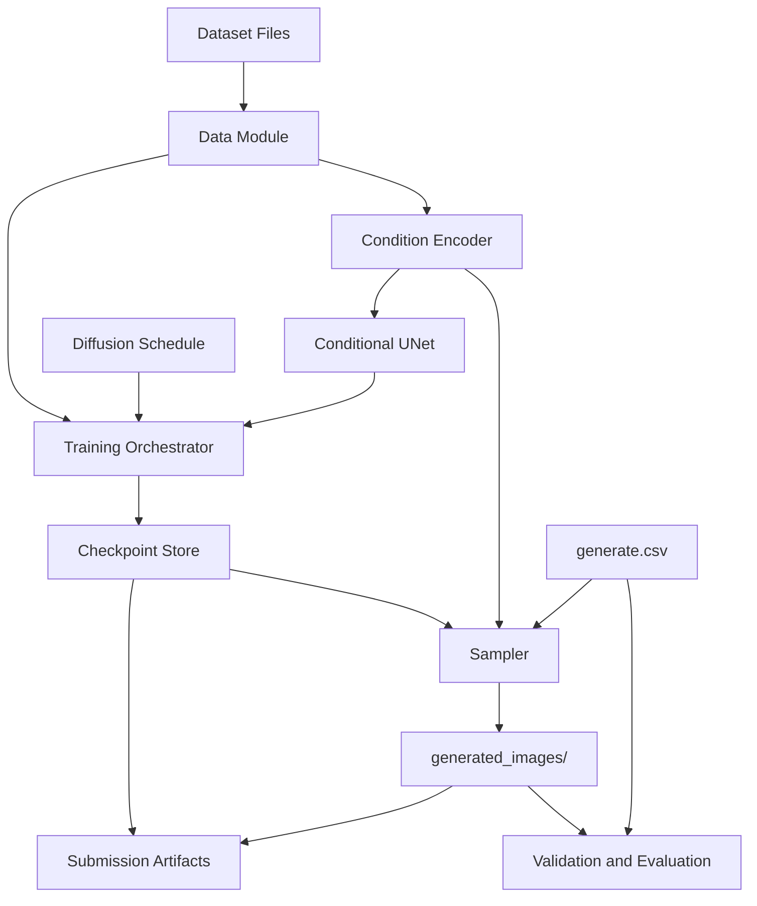

# High-Level Design

## Overview

This design describes a reproducible, from-scratch conditional image generation system for HW6 Brainrot Image Generation. The system trains a pixel-space conditional DDPM with a compact UNet backbone and uses EMA weights, classifier-free guidance, and DDIM sampling to generate the required submission images.

The final user-facing workflow is:

1. Prepare the Brainrot dataset and CSV files.
2. Train the conditional diffusion model from scratch.
3. Generate images from `generate.csv`.
4. Validate the generated image folder and optional local metrics.
5. Package the artifacts required by the assignment.

The design is intentionally organized around directly owned PyTorch modules and scripts. It does not include pretrained generative weights, Diffusers pipelines, or external generation services.

## Goals

- Train the main conditional image generator from scratch.
- Generate exactly 2,000 RGB PNG images at 64x64 resolution.
- Match each generated filename and condition from `generate.csv`.
- Support the assignment condition space of 10 animals, 10 objects, and 100 animal-object pairs.
- Optimize for both FID and CLIP-T through sample quality, diversity, and condition alignment.
- Preserve reproducibility through saved configs, label mappings, seeds, and checkpoints.
- Provide validation utilities before Codabench and E3 submission.

## Non-Goals

- Do not use pretrained generative model weights.
- Do not use pretrained UNet, Transformer, diffusion model, ControlNet, IP-Adapter, LoRA, DreamBooth, FLUX, SDXL, or Stable Diffusion checkpoints.
- Do not use high-level Diffusers-style pipelines or training flows as the submitted generation path.
- Do not rely on external generated images as the primary solution.
- Do not design a production service, web API, UI, or distributed training system.

## Requirements Summary

| Area | Requirement |
| --- | --- |
| Dataset | Read `train.csv` records containing `id`, `animal`, and `object`. |
| Conditions | Encode animal id, object id, and pair id. |
| Training images | Use 4,799 assignment training images when available locally. |
| Model | Train a conditional DDPM/DDIM generator from scratch. |
| Resolution | Train and generate RGB images at 64x64. |
| Training objective | Predict noise `epsilon` with MSE loss. |
| Diffusion schedule | Use 1,000 training timesteps with cosine schedule as the primary schedule. |
| Sampling | Use EMA weights and DDIM sampling with configurable step count. |
| Guidance | Support classifier-free guidance through condition dropout. |
| Generation CSV | Read `generate.csv` with `id`, `animal`, `object`, and `prompt`. |
| Output | Write exactly one RGB 64x64 PNG per `generate.csv` row into `generated_images/`. |
| Evaluation | Validate image count, names, mode, size, optional FID, optional CLIP-T proxy. |
| Submission | Produce artifacts compatible with `generated_images/`, scripts, `model.pth`, README, and requirements. |

## Proposed Architecture

The architecture is script-driven. Each workflow stage owns one major responsibility and exchanges explicit file or tensor contracts with the next stage.

## Modules

| Module | Responsibility | Inputs | Outputs | Dependencies |
| --- | --- | --- | --- | --- |
| Configuration Module | Define runtime paths, hyperparameters, schedule settings, architecture settings, seeds, and generation options. | Config file or CLI arguments. | Resolved config object. | None beyond standard parsing utilities. |
| Data Module | Load training metadata and images, validate format, apply conservative transforms, and expose batches. | Dataset root, `train.csv`, image files. | Image tensors, animal ids, object ids, pair ids. | Configuration Module, Condition Encoder. |
| Condition Encoder | Own stable mappings for animals, objects, and pairs; convert CSV strings to numeric ids; provide embedding inputs. | Animal/object strings or ids. | Animal ids, object ids, pair ids, optional dropped/null condition ids. | Configuration Module. |
| Diffusion Schedule Module | Build and expose timestep schedule, noise coefficients, and DDIM sampling schedule. | Number of timesteps, schedule type, DDIM step count. | Noise schedule tensors and sampling timestep sequence. | Configuration Module. |
| Conditional UNet Module | Predict noise from noisy image, timestep, and condition representation. | `x_t`, timestep ids, animal/object/pair ids or embeddings. | Predicted noise tensor with shape `[B, 3, 64, 64]`. | Condition Encoder, Diffusion Schedule Module. |
| EMA Module | Maintain and restore exponential moving average model weights. | Current model parameters and EMA decay. | EMA state dict for sampling. | Conditional UNet Module. |
| Training Orchestrator | Run direct PyTorch training, checkpointing, periodic sampling, and logging. | Config, data batches, model, schedule. | Checkpoints, EMA weights, logs, sample grids. | Data Module, Conditional UNet Module, Diffusion Schedule Module, EMA Module. |
| Sampler Module | Generate images with DDIM and classifier-free guidance. | Checkpoint, EMA weights, `generate.csv`, guidance scale, DDIM steps. | Generated image tensors and PNG files. | Condition Encoder, Conditional UNet Module, Diffusion Schedule Module. |
| Validation Module | Check submission structure and image properties. | `generate.csv`, `generated_images/`. | Validation report with pass/fail checks. | Data Module contracts for labels and filenames. |
| Evaluation Module | Compute optional local FID and CLIP-T proxy metrics when required files and dependencies are available. | Generated images, prompts, optional `test_mu.npy`, optional `test_sigma.npy`, optional CLIP dependency. | Metric report. | Validation Module. |
| Packaging Module | Assemble assignment artifacts for E3 and Codabench workflows. | Generated images, model checkpoint, scripts, README, requirements. | Submission-ready folder or zip. | Validation Module. |

## Module Relationships

- The Configuration Module is read by all workflow modules and should not depend on them.
- The Data Module depends on the Condition Encoder to convert labels from `train.csv` into ids.
- The Condition Encoder owns label mapping consistency between training and generation.
- The Diffusion Schedule Module is shared by training and sampling so that model training and DDIM generation use compatible diffusion coefficients.
- The Conditional UNet consumes condition ids or embeddings but does not read CSV files or image paths directly.
- The Training Orchestrator owns model optimization, EMA updates, checkpoint persistence, and periodic sample generation.
- The EMA Module is updated during training and is the default source of weights for final sampling.
- The Sampler reads `generate.csv`, asks the Condition Encoder for ids, uses the trained model, and writes only generated image outputs.
- The Validation Module verifies generated files before any packaging step.
- The Evaluation Module is optional and runs after validation so metric failures are not confused with malformed submissions.
- The Packaging Module depends on successful validation and collects final artifacts without modifying model behavior.

## Data Flow

### Training Flow

1. Configuration is loaded.
2. Data Module reads `train.csv` and image files from the configured dataset root.
3. Condition Encoder maps each `animal` and `object` to animal id, object id, and pair id.
4. Data Module returns image tensors and condition ids.
5. Training Orchestrator samples diffusion timesteps and Gaussian noise.
6. Diffusion Schedule Module creates noisy images `x_t`.
7. Conditional UNet predicts `epsilon`.
8. Training Orchestrator computes MSE loss, updates model weights, updates EMA weights, and writes checkpoints.

### Generation Flow

1. Sampler loads the saved config, label mappings, model checkpoint, and EMA weights.
2. Sampler reads each row from `generate.csv`.
3. Condition Encoder maps row conditions to ids.
4. DDIM sampling denoises random noise into an RGB image tensor using classifier-free guidance.
5. Sampler writes each output PNG to `generated_images/{id}`.
6. Validation Module checks output count, names, mode, and dimensions.

### Evaluation Flow

1. Validation Module confirms `generated_images/` is structurally valid.
2. Evaluation Module computes local FID if `test_mu.npy` and `test_sigma.npy` are available.
3. Evaluation Module computes CLIP-T proxy if the CLIP dependency and prompt records are available.
4. Results are written as a report for tuning decisions.

## Interfaces and Contracts

### `train.csv`

Required columns:

- `id`
- `animal`
- `object`

Contract:

- `id` resolves to a training image under the configured dataset image directory.
- `animal` and `object` values must be members of the 10 known animal and 10 known object vocabularies from the assignment.

### `generate.csv`

Required columns:

- `id`
- `animal`
- `object`
- `prompt`

Contract:

- Each row produces exactly one output image.
- Output filename must equal `id`.
- `prompt` is used for CLIP-T evaluation and should match the assignment format `a {animal} and a {object}`.

### Condition Mapping

The Condition Encoder must persist:

- animal vocabulary and ids
- object vocabulary and ids
- pair vocabulary and ids
- optional null condition id for classifier-free guidance

The same persisted mapping must be loaded during generation.

### Model Forward Contract

The Conditional UNet forward path accepts:

- noisy image tensor `x_t` with shape `[B, 3, 64, 64]`
- timestep tensor with shape `[B]`
- condition ids or condition embedding inputs for animal, object, and pair

It returns:

- predicted noise tensor with shape `[B, 3, 64, 64]`

### Checkpoint Contract

Training checkpoints should contain:

- model state dict
- EMA model state dict
- optimizer state
- scheduler state when applicable
- config
- label mappings
- global step or epoch
- random seed

The final generation command should be able to run from the checkpoint plus documented config.

### Generated Image Contract

`generated_images/` must contain:

- exactly 2,000 PNG files
- filenames matching `generate.csv`
- RGB mode
- 64x64 resolution
- one file per `generate.csv` row

## Operational Considerations

- Dataset paths should remain configurable because local dataset files were not observed.
- GPU-dependent settings such as base channel count, batch size, gradient accumulation, mixed precision, and DDIM step count should be configurable.
- EMA sampling should be the default generation path because the proposal identifies it as the sampling target.
- Training should periodically emit sample grids across representative animal-object pairs to detect ignored conditions early.
- Validation should run before packaging and before Codabench submission.
- CLIP-T proxy evaluation may require a pretrained CLIP dependency, which is allowed only as an auxiliary evaluation or condition-support module.
- If local metric files are unavailable, metric evaluation should skip gracefully and still allow structural validation.

## Risks and Tradeoffs

- Larger UNet settings may improve FID but can exceed available GPU memory or training time.
- Higher classifier-free guidance can improve condition alignment and CLIP-T but may reduce diversity and worsen FID.
- Pair embeddings can help known pair composition but may reduce flexibility if unexpected pairs appear.
- Conservative augmentation may improve FID, while aggressive augmentation may damage object identity and CLIP-T.
- DDIM with fewer steps speeds generation but may lower sample quality.
- The StyleGAN2-ADA fallback may improve limited-data FID but introduces higher risk of condition collapse, so it should remain secondary to the diffusion path.

## Open Questions

- Where will the dataset root, image folder, `train.csv`, and `generate.csv` be placed locally?
- What GPU and training time budget should the default config target?
- Are `test_mu.npy` and `test_sigma.npy` available locally for FID evaluation, and where should the default paths point?
- Should optional pretrained CLIP conditioning be included in the design later, or should the first implementation use only learned class embeddings?
- What exact package manager layout should be used for the greenfield project if no `pyproject.toml` or `uv.lock` exists yet?
